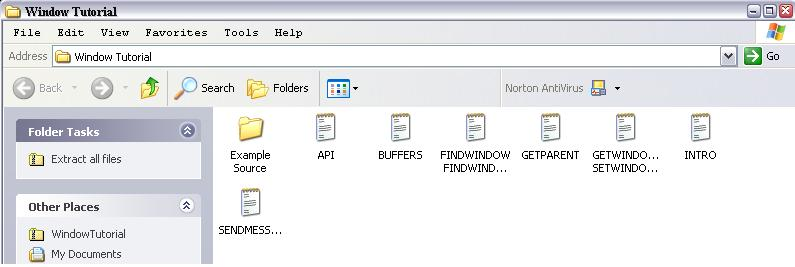



## \_A Supreme Window API tutorial \*\*\*\*

### Description

READ ALL

----

This is a COMPLETE tutorial on api concerning actual windows. FINDWINDOW(), FINDWINDOWEX(), GETPARENT(), GETWINDOWTEXT(), SETWINDOWTEXT(),SENDMESSAGE(), WindowFromPoint(),WM_ constants, EM_ constants. All separate tutorials for advanced programmers, and also go in order for new api programmers. I cover pointers, buffers, basic api, window api, cover it deeply and completely, and include sample code and examples. You need to see if you have a pretty good or no grasp of window api. Learn how to make an API spy from this as well. You will be extremely pleased. Uses notepad for all examples. Also teaches parent/child hwnd types, explains hwnd, does everything! Please download and vote :-) KEYWORDS: Jaime Muscatelli
 
### More Info
 

             |
---                |---
**Submitted On**   |2003-01-03 00:42:54
**By**             |[Jaime Muscatelli](https://github.com/Planet-Source-Code/PSCIndex/blob/master/ByAuthor/jaime-muscatelli.md)
**Level**          |Beginner
**User Rating**    |4.8 (368 globes from 76 users)
**Compatibility**  |VB 6\.0
**Category**       |[Windows API Call/ Explanation](https://github.com/Planet-Source-Code/PSCIndex/blob/master/ByCategory/windows-api-call-explanation__1-39.md)
**World**          |[Visual Basic](https://github.com/Planet-Source-Code/PSCIndex/blob/master/ByWorld/visual-basic.md)
**Archive File**   |[A\_Supreme\_152293132003\.zip](https://github.com/Planet-Source-Code/jaime-muscatelli-a-supreme-window-api-tutorial__1-42126/archive/master.zip)

